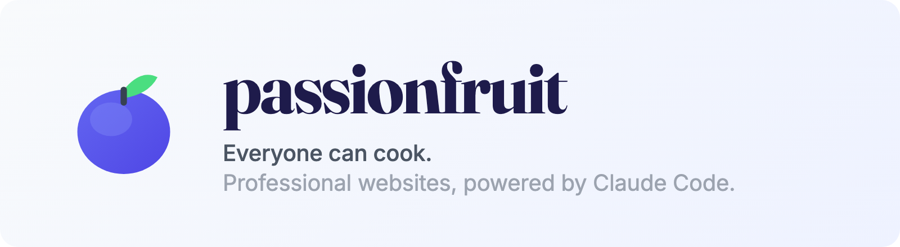

<picture>
  <source media="(prefers-color-scheme: dark)" srcset=".github/banner-dark.png">
  <source media="(prefers-color-scheme: light)" srcset=".github/banner-light.png">
  
</picture>

<p align="center">
  <a href="https://github.com/passion4it-gmbh/passionfruit/blob/main/LICENSE"></a>
  <a href="https://astro.build"></a>
  <a href="https://www.typescriptlang.org"></a>
  <a href="https://tailwindcss.com"></a>
  <a href="https://pages.cloudflare.com"></a>
</p>

<p align="center">
  <strong>A website template that turns Claude Code into your web developer.</strong><br>
  Create a repo, type <code>/onboard</code>, answer a few questions — done. No coding required.
</p>

> **Looking at the template source?** This repo (`passion4it-gmbh/passionfruit`) is the template itself. The Greenleaf Digital content you see is fixture/example data — downstream users replace it via `/onboard`. If you want to _use_ the template, click **Use this template** above. If you want to _contribute to_ the template, see [`CLAUDE.md`](./CLAUDE.md) §1.

---

## Quick Start

```
1. Click "Use this template" on GitHub → create your repo
2. Clone it and open with Claude Code
3. Type /onboard
```

That's it. Claude asks about your business, sets up your site, and hands you a working website.

**Going live?** Type `/deploy` — Claude walks you through Cloudflare Pages (free). Every push to `main` auto-deploys after that.

---

## What You Get

|                    |                                                                                 |
| ------------------ | ------------------------------------------------------------------------------- |
| **Bilingual**      | German + English out of the box, with localized slugs and hreflang              |
| **Blog & Team**    | Markdown-based content collections — type `/new-post` or `/new-team-member`     |
| **Modern Design**  | Scroll-driven animations, glass effects, fluid typography, responsive           |
| **GDPR-Ready**     | Cookie consent + PostHog analytics (EU-hosted, env-var-gated)                   |
| **Quality Gates**  | ESLint, TypeScript strict, spell check (DE+EN), link checker, commit hooks      |
| **SEO**            | Structured data, bilingual sitemap, Open Graph tags, canonical URLs             |
| **Accessible**     | WCAG AA — semantic HTML, keyboard nav, alt-text enforcement, 44px touch targets |
| **Self-Improving** | CLAUDE.md evolves as you work — Claude never forgets your preferences           |

---

## Skills

Claude Code skills are interactive commands that guide you through tasks step by step.

| Skill              | What it does                                                             |
| ------------------ | ------------------------------------------------------------------------ |
| `/onboard`         | Personalize the template for your business (or migrate an existing site) |
| `/brand`           | Replace the placeholder favicon and social preview image                 |
| `/deploy`          | Set up Cloudflare Pages hosting (free, automatic HTTPS)                  |
| `/new-post`        | Create a bilingual blog post with correct frontmatter                    |
| `/new-team-member` | Add a team member with photo and bio                                     |

---

## Why Not WordPress?

|               | passionfruit                                  | WordPress                                |
| ------------- | --------------------------------------------- | ---------------------------------------- |
| **Speed**     | Static HTML — loads instantly                 | Dynamic PHP, plugins slow it down        |
| **Security**  | No server, no plugins, no attack surface      | Constant patching, plugin CVEs           |
| **Cost**      | Free hosting (Cloudflare Pages)               | Hosting + themes + plugins add up        |
| **AI-Native** | Claude reads every file, modifies anything    | Locked behind admin panels               |
| **Updates**   | Tell Claude what to change, in plain language | Navigate menus, hope plugins don't break |

---

## Tech Stack

<table>
<tr>
<td><a href="https://astro.build"><strong>Astro 6</strong></a></td>
<td>Static site generation — fast builds, zero JS by default</td>
</tr>
<tr>
<td><a href="https://tailwindcss.com"><strong>Tailwind CSS v4</strong></a></td>
<td>Utility-first styling with design tokens in <code>@theme</code></td>
</tr>
<tr>
<td><a href="https://www.typescriptlang.org"><strong>TypeScript</strong></a></td>
<td>Strict mode, no <code>any</code> — catches bugs before they ship</td>
</tr>
<tr>
<td><a href="https://pnpm.io"><strong>pnpm</strong></a></td>
<td>Fast, disk-efficient package manager</td>
</tr>
<tr>
<td><a href="https://pages.cloudflare.com"><strong>Cloudflare Pages</strong></a></td>
<td>Free hosting with automatic HTTPS and global CDN</td>
</tr>
</table>

---

## Staying Current

passionfruit is a one-shot template — your project is yours once it's scaffolded. But passionfruit itself keeps evolving (new components, design improvements, security fixes), and you can pull those in whenever you want.

**The Claude-driven way (recommended):**

```
Check passion4it-gmbh/passionfruit/releases for versions newer than
ours. Pull in the newsletter signup component from the latest release
and adapt it to our brand colors.
```

Claude fetches the relevant files from the latest release, adapts them to your codebase, and wires them in. You only adopt what's useful.

**The git-native way:**

```bash
git remote add upstream https://github.com/passion4it-gmbh/passionfruit.git
git fetch upstream main
git log HEAD..upstream/main --oneline       # see what's new
git cherry-pick <sha>                        # pick a specific change
```

Expect conflicts on `src/i18n/*.json`, `src/lib/page-registry.ts`, and `src/content/` — those are your business content, keep your version.

Watch [Releases](https://github.com/passion4it-gmbh/passionfruit/releases) (click "Watch" → "Custom" → "Releases" on the repo) to get notified when there's something worth adopting.

---

## For Developers

passionfruit uses a **page registry** (`src/lib/page-registry.ts`) that drives routing, i18n slug mapping, and hreflang generation. All pages go through a single catch-all route — no scattered files in `src/pages/`.

Content lives in `src/content/` as Markdown collections (blog, team, pages), paired across locales via a `translationKey` frontmatter field. A pre-build script enforces bilingual symmetry.

**Key references:**

- [`CLAUDE.md`](./CLAUDE.md) — project conventions, architecture, commands
- [`STYLE_GUIDE.md`](./STYLE_GUIDE.md) — design system: colors, typography, components, animations
- [`CONTRIBUTING.md`](./CONTRIBUTING.md) — content workflows for blog, team, and pages

**Commands:**

```bash
pnpm dev              # Dev server at localhost:4321
pnpm build            # Production build (lint + typecheck + bilingual check)
pnpm check:all        # Full CI suite locally
pnpm generate-image   # GPT Image generation (needs OPENAI_API_KEY)
```

---

<p align="center">
  Built with care by <a href="https://passion4it.de"><strong>PASSION4IT</strong></a><br>
  <sub>Need professional help with your digital project? <a href="https://passion4it.de/kontakt/">Get in touch</a>.</sub>
</p>

<p align="center">
  <sub>MIT License — see <a href="./LICENSE">LICENSE</a></sub>
</p>
